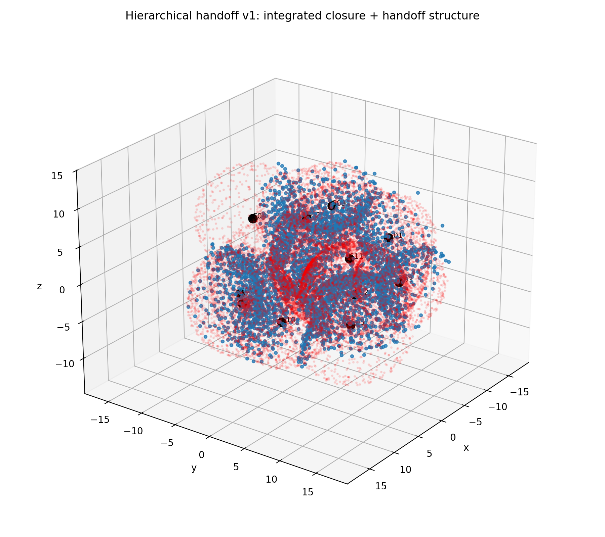
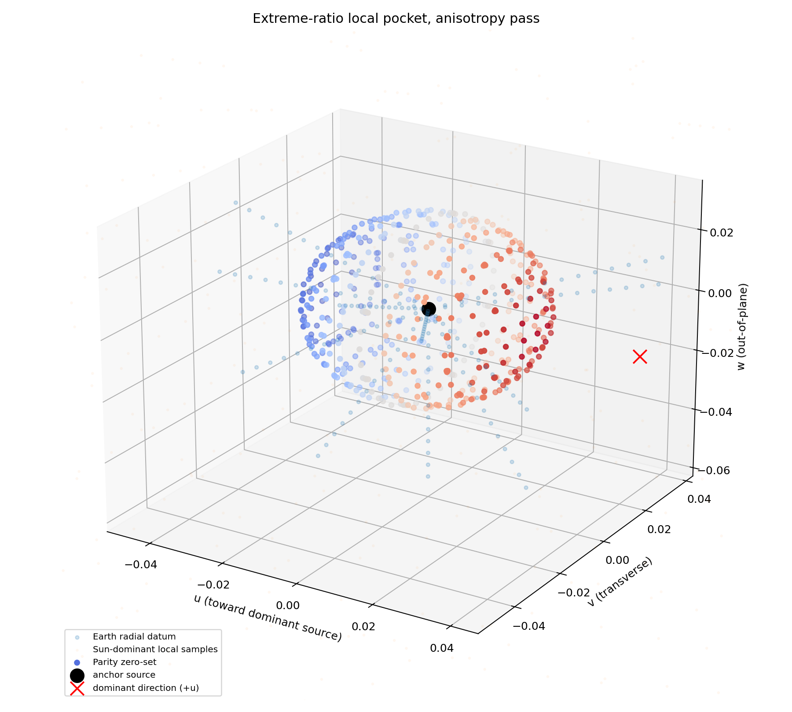

## Featured Rendering

  <video width="50%" height="auto" controls autoplay loop muted style="border-radius: 8px; box-shadow: 0 4px 12px rgba(0,0,0,0.3);">
    <source src="images/binaryB_rotation.mp4" type="video/mp4">
    Your browser does not support the video tag.
  </video>
  
<em>Primary Visualization: 12 star cluster</em>

## Technical Highlights

  

    
    
<small><strong>Focus A:</strong> Brief caption here.</small>

  

  

    
    
<small><strong>Focus B:</strong> Brief caption here.</small>

  

  

    
    
<small><strong>Focus C:</strong> Brief caption here.</small>

  

## Archive & Supplementary Data

  
  

<small>Fig 01: Caption</small>

  

<small>Fig 02: Caption</small>

  

<small>Fig 03: Caption</small>

  

<small>Fig 04: Caption</small>

  

<small>Fig 05: Caption</small>

  

<small>Fig 06: Caption</small>

  

<small>Fig 07: Caption</small>

  

<small>Fig 08: Caption</small>

  

<small>Fig 09: Caption</small>

  

<small>Fig 10: Caption</small>

  

  

[Back to Hub](/)
