

<h2>Featured Rendering</h2>

  

    <figure>
      <video controls autoplay loop muted playsinline>
        <source src="images/mutual network rotate.mov" type="video/quicktime">
      </video>
      <figcaption>
        12-Star Cluster Parity Network — Rotation
        Primary visualization: relational parity network for a 12-source stellar configuration.
      </figcaption>
    </figure>
  

<h2>Technical Highlights</h2>

  

    <figure>
      
      <figcaption>
        Localized Parity Surface
        Parent-support structure under slow rotation in the EMS configuration.
      </figcaption>
    </figure>
  

  

    <figure>
      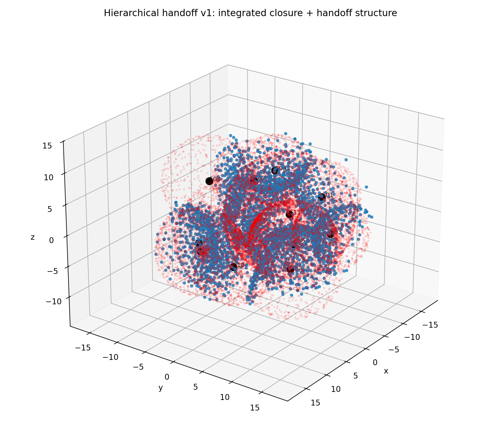
      <figcaption>
        Integrated Handoff Mapping
        Cross-scale domain transition geometry.
      </figcaption>
    </figure>
  

  

    <figure>
      <video id="focusC" autoplay loop muted playsinline>
        <source src="images/binaryB_rotation.mp4" type="video/mp4">
        <source src="images/binaryB_rotation.mov" type="video/quicktime">
      </video>
      <figcaption>
        Binary-B High-Resolution Diagnostic
        High-resolution parity diagnostic for a binary source configuration.
      </figcaption>
    </figure>
  

<h2>Network Simulations & Major Renders</h2>

  

    <figure>
      <video autoplay loop muted playsinline>
        <source src="images/relational_network_rotate_5.mp4" type="video/mp4">
      </video>
      <figcaption>
        Relational Network Rotation
        Parity network topology under rotation — full relational geometry of a multi-source configuration.
      </figcaption>
    </figure>
  

  

    <figure>
      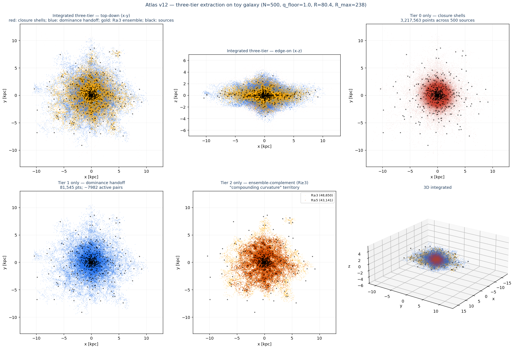
      <figcaption>
        v12 — Three-Tier, 500-Source Stack
        Full parity stack render across three tiers with 500 declared sources.
      </figcaption>
    </figure>
  

  

    <figure>
      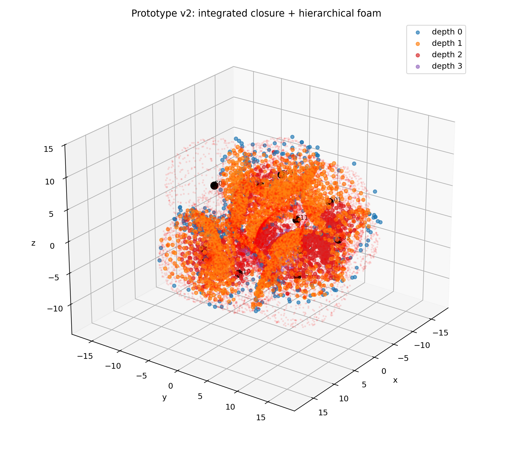
      <figcaption>
        Integrated Hierarchical Foam — v2
        Nested jurisdiction geometry in a dense multi-source configuration.
      </figcaption>
    </figure>
  

<h2>Neutral Isotropic Boundary Studies</h2>

  

    <figure>
      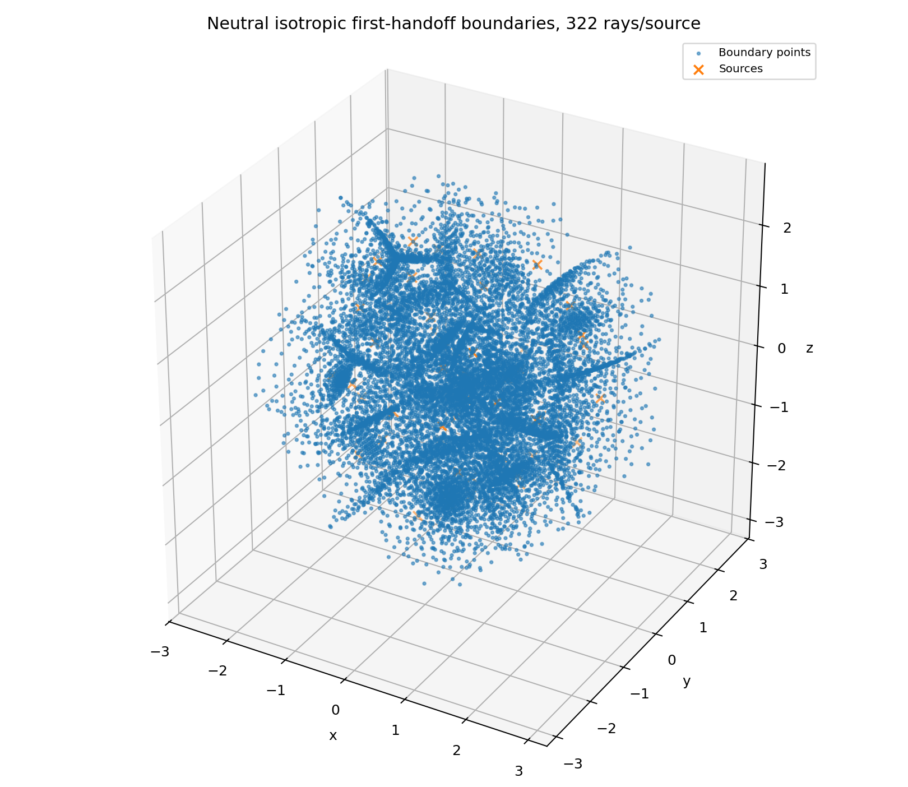
      <figcaption>
        High Density — XY Plane
        Parity boundary topology in a high-density neutral isotropic source distribution.
      </figcaption>
    </figure>
  

  

    <figure>
      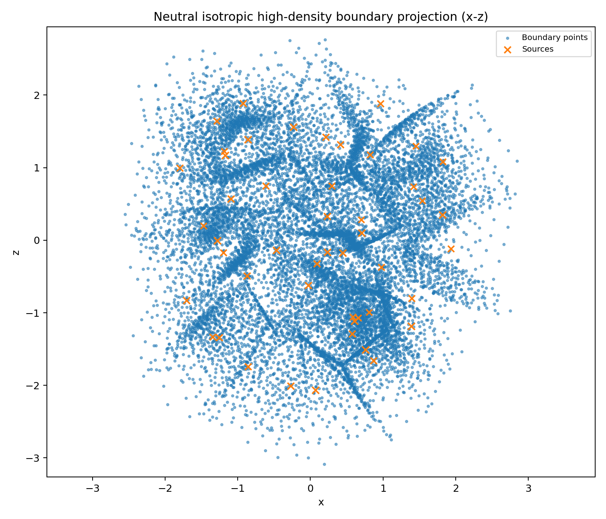
      <figcaption>
        High Density — XZ Plane
        Cross-sectional view of the same configuration along the XZ plane.
      </figcaption>
    </figure>
  

  

    <figure>
      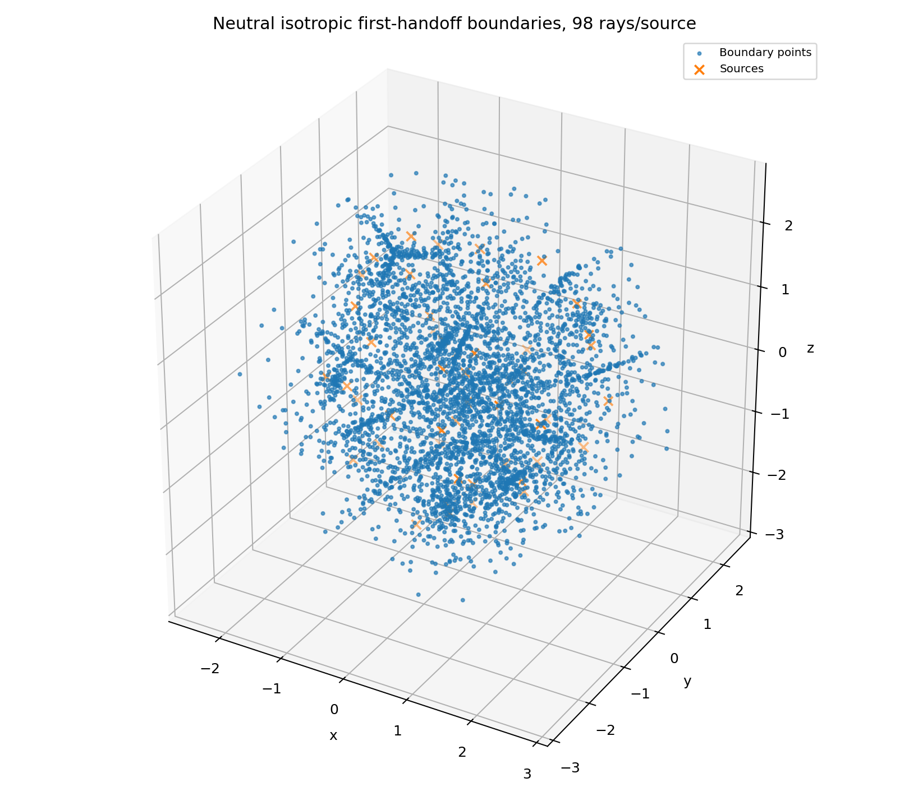
      <figcaption>
        Low Density
        Boundary geometry at reduced source density — expanded jurisdiction cells with wider parity margins.
      </figcaption>
    </figure>
  

<h2>Archive & Supplementary Data</h2>

  

    <figure>
      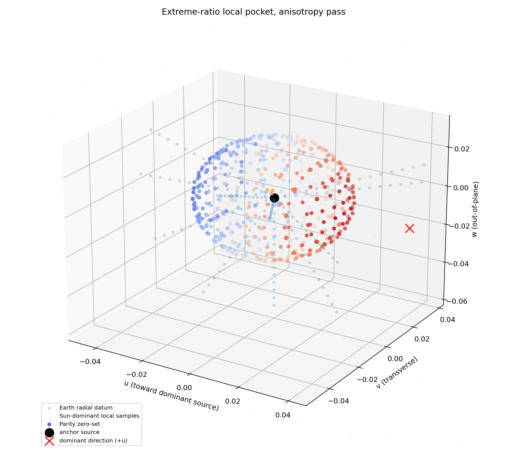
      <figcaption>
        Fig 01
        Arrangement of iron atoms
      </figcaption>
    </figure>
  

  

    <figure>
      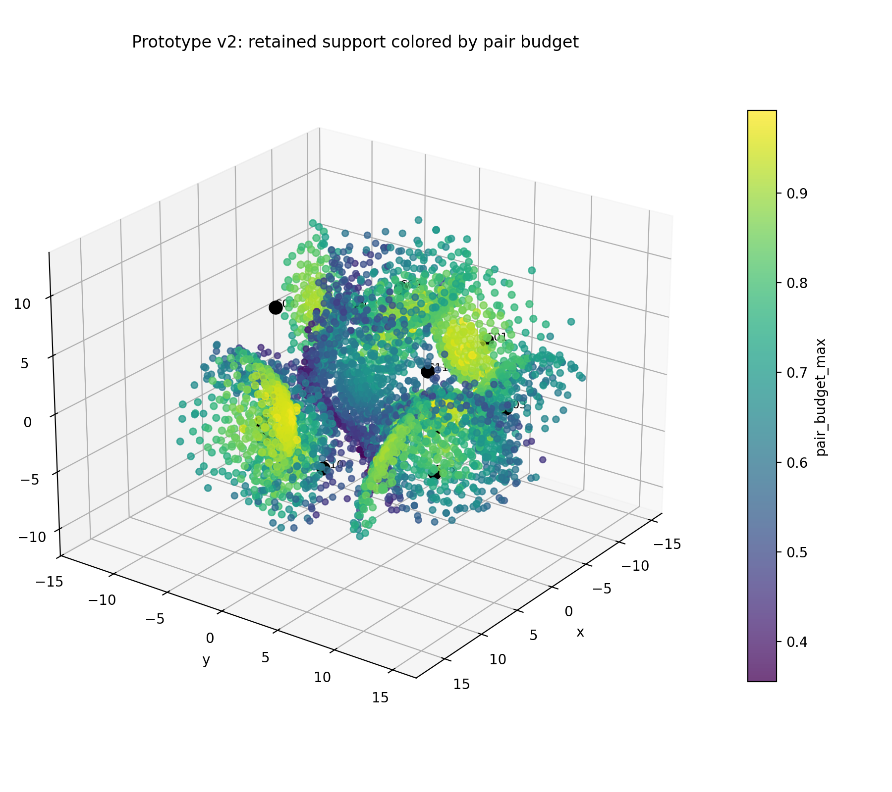
      <figcaption>
        Fig 02
        Retained pair budget
      </figcaption>
    </figure>
  

  

    <figure>
      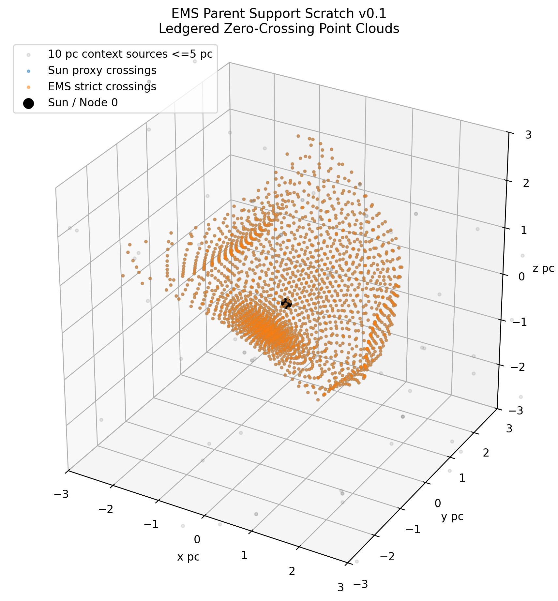
      <figcaption>
        Fig 03
        Crossing clouds
      </figcaption>
    </figure>
  

  

    <figure>
      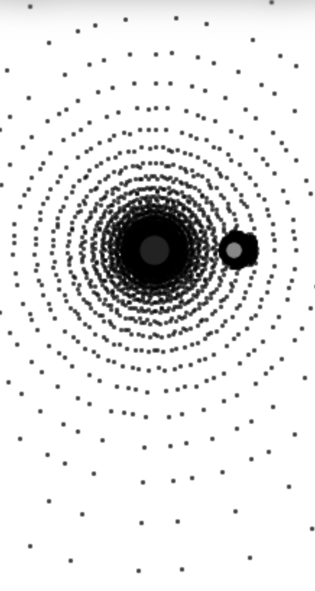
      <figcaption>
        Fig 04
      </figcaption>
    </figure>
  

  

    <figure>
      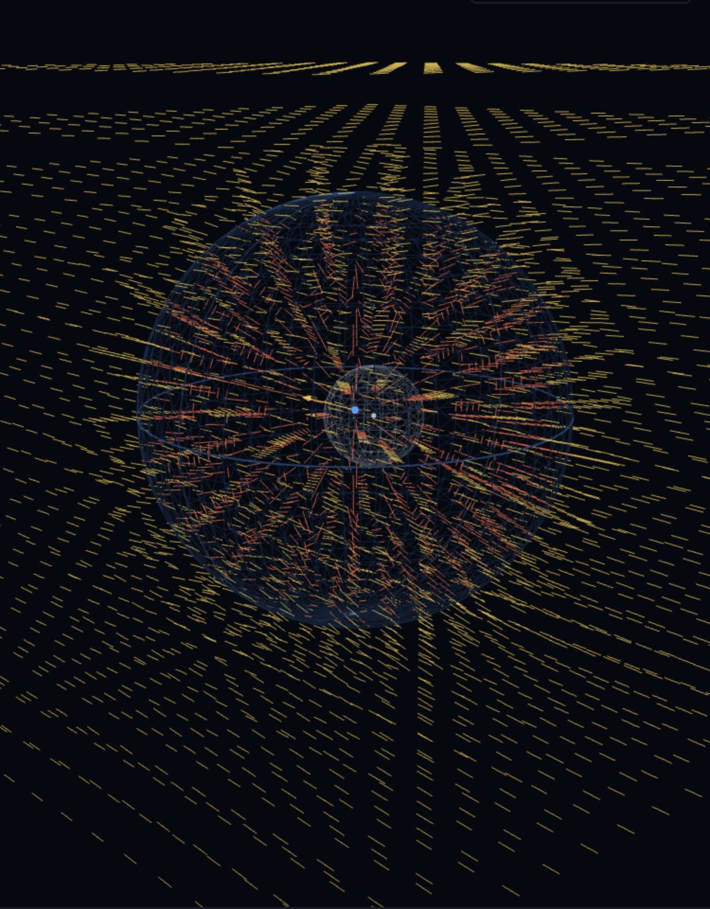
      <figcaption>
        Fig 05
      </figcaption>
    </figure>
  

  

    <figure>
      
      <figcaption>
        Fig 06
      </figcaption>
    </figure>
  

  

    <figure>
      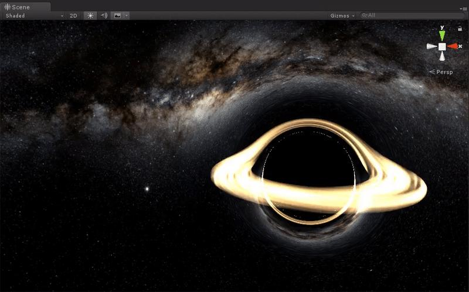
      <figcaption>
        Fig 07
      </figcaption>
    </figure>
  

[Back to Hub](/)

