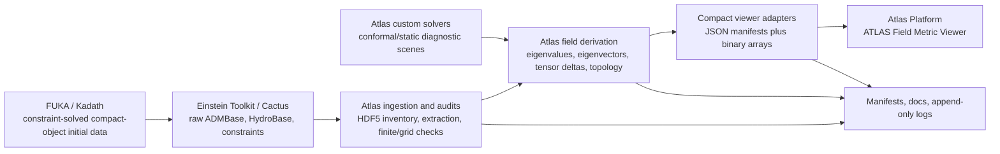

# Architecture and Data Flow

## Platform Shape

Atlas Platform is a browser-based 3D interrogation surface over compact,
versioned field payloads. It does not solve Einstein's equations in the browser.
Model construction, ingestion, tensor extraction, auditing, and export occur in
separate repo lanes; the viewer reads their manifests and binary arrays.

## Viewer Runtime

The present application is a single `index.html` containing HTML, CSS, and the
main JavaScript module. It imports vendored Three.js `0.160.0` and
OrbitControls, fetches JSON and binary payloads over HTTP, and renders WebGL point,
vector, source, displacement, lattice, and candidate-surface layers.

Because payloads are fetched, `file://` operation is intentionally unsupported.
The current runtime does not require a CDN for Three.js; the pinned library is
stored under `pinch_lab_viewer/vendor/`.

## Five Modular UI Lanes (updated 2026-07-19)

A fourth lane, **BL Foam**, was added 2026-07-15/16: the home of the canonical
LSN-66 BL base model, its frozen arrangements, the layer stack, and the
interior parity shell live lab. Three.js is now vendored locally (no unpkg
dependency). See [[06 Current State and Development Contract]] and
[[07 One-Model Redesign Blueprint]].

A fifth isolated lane, **Temporal NR**, was added 2026-07-19. It reads the
compact `ATLAS_TEMPORAL_PILOT_I_ET_ARCHIVE_001` payload generated from two
genuine archived Einstein Toolkit `ML_BSSN::phi` slices, with horizon and
puncture context. Its registered residual is explicitly coordinate-dependent,
interpolation-dependent, non-invariant, and not gauge-free. The raw HDF5 cache
stays outside the browser frontend, and the adapter does not imply unavailable
full metric, extrinsic-curvature, constraint, or `E_ij` fields.

## Three Original UI Lanes

### Atlas Native

The default scientific-interaction lane. It owns:

- dataset and target selection;
- single-layer, wink, feature-shift, and comparison modes;
- scalar fields and full/removed/delta comparison;
- Cartesian, staggered, blue-noise, and radial probe activation;
- point opacity, point size, density, and phase controls;
- source presence and removal/influence storytelling;
- feature displacement;
- Lumen Lattice placeholder diagnostics;
- eigen-gap, angle, and amplitude footprint thresholds;
- baseline and removed eigenvectors, unstable points, sources, and candidate
  surface preview;
- probe inspection drawer and topology summaries.

### Imported Tools

A read-only advisory launchpad. The browser does not execute shell commands. It
loads `imported_tools/tool_launch_manifest.json`, exposes vetted commands, and
links to generated artifacts for kuibit, yt, openPMD, EinsteinPy, OGRePy, and the
Atlas 3D showcase renderer. Imported outputs do not replace Atlas ledgers.

### Recovery Lab

An experimental, removable adapter over registered full/ablation controls. It
owns proper-volume tensor witnesses, resolution/domain/grid-shift realizations,
orientation conditioning, sampling controls, and evidence-status views. Its data
lives under `recovery_lab/`; it is inactive by default and should remain
separable from the other two lanes.

## Viewer Payload Contract

Native dataset directories generally contain:

- `viewer_dataset_manifest.json`;
- `positions.bin` as `Float32Array`;
- `grid_index.bin` as `Uint16Array`;
- `scalars.bin` as `Float32Array`;
- `e0_full.bin` and `e0_removed.bin` as `Float32Array` eigenvectors;
- `flags.bin` as `Uint8Array`;
- optional `radial_summary.json`.

Multi-target families add `viewer_multi_manifest.json`, which points to one
dataset manifest per removal target. Binary ordering and scalar-field ordering
are controlled by each manifest. Never infer those contracts from filenames
alone.

Recovery Lab uses `recovery_manifest.json` plus case/realization payloads with
positions, indexes, scalars, and flags. It performs its own registered baseline
and realization mapping.

## Scientific Provenance Classes

| Class | Meaning | Examples |
|---|---|---|
| Raw ET output | Cactus-produced HDF5 fields | `Cactus/ATLAS_TOV3_DIAG/*.h5` |
| Certified ET substrate | Atlas extraction and audit of identified HDF5 arrays | `ET_HDF5_INGEST_001` |
| Custom constrained diagnostic | Atlas model under declared slice assumptions | Gaia parent and StageB caches |
| Derived field | Tensor/eigen/topology quantity computed from a source substrate | Pinch eigenfield and Recovery Lab |
| Viewer adapter | Compact binary representation for interactive display | `pinch_lab_viewer/datasets` |
| Visualization-only state | Styling, displacement, sampling, or camera choice | viewer controls |

No visualization-only state may be promoted as physical evidence by itself.

## ET And FUKA Boundary

Einstein Toolkit is a separate Desktop tree. Atlas reads its HDF5 products but
does not embed Cactus in the viewer. FUKA/Kadath is the initial-data frontier for
a genuinely coupled compact-object slice; the intended future flow is:

`FUKA solve -> Kadath importer -> separate ET configuration -> ADM/Hydro and
constraint HDF5 -> Atlas certification -> compact viewer adapter`.

That route has not yet completed for a binary. See [[05 Dataset and Model Registry]].

## Addendum 2026-07-18 — Commons + Dynamic Witnesses Data Flow

Two additional bake pipelines feed the one render world (freeze-in-time
throughout; the browser fetches, it does not compute):

- `scripts/et_tov3_scout/bake_commons_atlas.mjs` ->
  `datasets/COMMONS_ATLAS_001/` (webbing.f32: 64^3 declared volume
  lattice near-parity nodes with band/nearC/entropy channels;
  islands.json: 9 troughs + certified H=0.75 surface) -> Commons Layers
  section of the BL Layer Stack (`commonsLayersUpdate`) and the
  standalone adapter `commons_atlas.html`. The commons<->network wink
  drives the layer CHECKBOXES, so passport and pipelines stay truthful.
- `scripts/et_tov3_scout/bake_magnetic_weyl.mjs [kinematics.json]
  [OUT_DIR]` -> `datasets/MAGNETIC_WEYL_001/` (declared synthetic
  kinematics) and `.../MAGNETIC_WEYL_002/` (harvested SIMBAD
  kinematics via `harvest_kinematics.mjs`; frame recovered by Horn
  fit) -> Dynamic Witnesses section (`dynLayersUpdate`): ||B|| /
  magfrac / |P_BR| / ||M|| clouds + signed P_BR flow streaks
  (pvec.f32, ratified E-sign map). B and the monitor are LINEAR in
  beta: amplitude rescales without re-bake.

Both lanes are gaia66-gated: payloads are baked from the base model
only; passport entries are gated on the same condition so the declared
stack always matches the screen. all-layers-off covers every new
checkbox.
