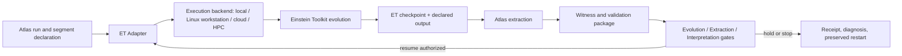

# ET Temporal Harness Master Specification

> [!important] Sole current master
> This is the single current Atlas design basis for an Einstein Toolkit temporal
> harness. Older ET, Temporal Pilot, SXS, and viewer records remain evidence and
> history; they do not compete with this specification. This document defines a
> design and certification program. Phase I implemented and mock-validated the
> Atlas control spine; Phase II-A completed a bounded real `LOCAL_ET`
> checkpoint/restart smoke path; and Phase II-C validated the evolved
> E/B/complex-Weyl measurement subsystem with an explicit extraction floor.
> Temporal Pilot I has now completed one bounded dynamic Teukolsky-wave history
> across a genuine restart and resolved the B-channel change above that floor.
> This certifies only the named microscopic engineering benchmark; it does
> **not** certify a general production envelope or astrophysical NR accuracy.

**Version:** 1.0

**Adjudication date:** 2026-07-27

**Execution state:** design integrated; Phase-I control spine implemented and
mock-backend validated; bounded `LOCAL_ET` checkpoint/restart execution proven;
canonical E/B/complex-Weyl extraction and uncertainty budgeting validated; and
the named 33^3 one-level Teukolsky-wave pilot completed t0->t1->t2 with a
genuine t1 restart, passing gates, zero swap growth, and resolved B evolution

**Research lanes:** [[12 Constraint Geometry and Return Maps - Internal Research Frame]]

## 1. Purpose and governing boundary

The harness turns a numerical-relativity evolution into a sequence of bounded,
auditable Atlas interrogation segments. It must preserve the division of labor:

- **Einstein Toolkit owns spacetime evolution.** ET formulations, evolution
  variables, gauge drivers, timestepping, refinement, boundary treatment, and
  checkpoint state remain ET responsibilities.
- **Atlas owns orchestration and witnessing.** Atlas owns run declarations,
  segment planning, extraction requests, derived witnesses, registration,
  diagnostics, provenance, validation batteries, machine-health and
  interpretation gates, continuation decisions, and temporal claim discipline.
- Atlas never replaces ET evolution with a viewer animation, interpolation,
  reduced diagnostic, return map, or inferred motion.
- ET output is substrate. Atlas products are declared measurements of that
  substrate. GR, not Atlas vocabulary or visual design, decides physical meaning.

In short: **ET owns spacetime evolution. Atlas owns orchestration and
witnessing.**

The canonical cadence is:

`STEP -> CHECKPOINT -> EXTRACT -> WITNESS -> ADJUDICATE -> RESUME`

`RESUME` is permitted only when the applicable evolution, extraction, and
interpretation gates are independently satisfied or an explicitly bounded
exception has been authorized and recorded.

## 2. Architecture and responsibility map

The **ET Adapter** is the portability boundary. Atlas orchestration must address
the adapter contract, not hard-code a Mac path, scheduler, MPI launcher, or
specific backend into scientific logic. The adapter must eventually support:

- local Mac smoke work within its certified envelope;
- a dedicated Linux workstation, the preferred sustained-compute target;
- a verified remote workstation or lab server;
- cloud or HPC schedulers;
- immutable input transfer and hashed checkpoint/extraction return.

The Mac remains the cockpit: declaration, staging, inspection, compact
extraction, adjudication, visualization, and provenance. External compute
extends execution; it does not retire the local ET installation or change the
scientific contract. Apple eGPU support is not a dependency or roadmap premise.

## 3. The three cadences

The harness must never use “time step” as a catch-all.

| Cadence | Owner | Meaning |
|---|---|---|
| ET timestep | ET | Integrator update at the formulation's numerical timestep |
| Extraction epoch | ET + adapter | Declared simulation time/iteration at which fields are materialized for Atlas |
| Atlas temporal segment | Atlas | Governance interval bounded by resumable checkpoint/extraction/adjudication events |

The **temporal segment** is the unit of governance, provenance, machine-health
review, and claim change. Atlas does not adjudicate every ET timestep. Multiple
timesteps may occur inside a segment and more than one extraction epoch may be
declared where justified, but every segment closes with a coherent decision.

An extraction epoch may coincide with an ET checkpoint, but the objects are not
identical:

> ET stores state. Atlas derives witnesses.

An ET checkpoint is restart state governed by ET. An Atlas extraction is a
declared, versioned transformation of identified ET fields into an audit-ready
witness package. A checkpoint without extraction can support restart but not an
Atlas scientific claim. An extraction without a verified restart checkpoint may
support bounded analysis but not safe continuation.

## 4. Segment state machine

Each segment has a unique identifier and transitions through:

1. **Declared** — formulation, backend, initial/restart state, resource class,
   duration, extraction epochs, fields, tolerances, and stop conditions frozen.
2. **Stepping** — ET advances within the declared segment.
3. **Checkpointed** — restart products closed and integrity-tested.
4. **Extracted** — declared fields copied or transformed with source identities.
5. **Witnessed** — diagnostic package and validation results assembled.
6. **Adjudicated** — three gate-family outcomes and claim state recorded.
7. **Resumable, held, or stopped** — only `resumable` may seed the next segment.

Failure must preserve the last known-good checkpoint, logs, partial outputs, PID
and process disposition, machine-health evidence, and the reason for hold/stop.
Resource exhaustion is not physical nonconvergence and not scientific evidence.

## 5. Three independent gate families

### 5.1 Evolution gate

Asks whether ET evolution and the machine remain fit to continue. At minimum:

- ET exit/progress state and expected iteration/time advance;
- formulation-specific constraints and stability monitors;
- NaN/Inf, blow-up, boundary, refinement, and timestep health;
- checkpoint completeness and restart test status;
- wall time, resident memory, compressed memory, swap, disk/I/O growth, thermal
  behavior, throttling/slowdown indicators, and process-tree state.

An evolution gate may stop a scientifically ordinary run because the machine is
unsafe. That is an engineering stop, not a physics verdict.

### 5.2 Extraction gate

Asks whether the proposed witness package is truthfully derivable from the
identified ET state. At minimum:

- source checkpoint/output identifiers and hashes;
- field availability, centering, refinement levels, ghost/halo treatment,
  units, conventions, time labels, and region support;
- extraction code version, parameters, transforms, interpolation, masks, and
  data-loss accounting;
- shape, dtype, finite-value, coverage, checksum, and round-trip checks;
- explicit missing-field and unsupported-region declarations.

An extraction failure does not imply an evolution failure. It holds Atlas claims
and continuation when the next segment depends on the missing witness.

### 5.3 Interpretation gate

Asks what the witnesses actually warrant. At minimum:

- observer/foliation and invariant channels kept separate;
- registration validity and uncertainty;
- convergence, controls, cross-witness consistency, and alternative
  explanations;
- event-localization uncertainty and ordering semantics;
- claim status, limitations, and forbidden promotions.

A numerically healthy, completely extracted segment can still fail the
interpretation gate. That means “no supported claim,” not “bad ET.”

Gate outcomes are recorded separately as `PASS`, `PASS_WITH_BOUND`, `HOLD`, or
`STOP`; a single omnibus “green” flag is forbidden.

## 6. V1 scope and minimum diagnostic aperture

V1 retains full numerical relativity under the hood while exposing only the
smallest aperture that can support safe continuation and honest witnessing. V1
is not a reduced-gravity solver.

The minimum witness package, when the formulation and source support it, is:

- spatial metric `gamma_ij`;
- extrinsic curvature `K_ij`;
- lapse `alpha`;
- shift `beta^i` when required for reconstruction, transport, or registration;
- Hamiltonian and momentum constraints plus declared formulation-specific
  health monitors;
- curvature-health fields and finite/nonfinite summaries;
- electric and magnetic Weyl tensors `E_ij` and `B_ij` under explicit observer,
  foliation, orientation, sign, index, and unit conventions;
- compact field summaries, norms, extrema, quantiles, support, and deltas;
- registration products and uncertainties;
- source checkpoint/output identities, hashes, extraction manifest, software
  versions, and audit results.

If a field is unavailable, the package must say so. A proxy may be retained in
its own channel but must not impersonate the missing field.

## 7. Weyl field and diagnostic naming contract

### 7.0 Frozen electric-Weyl / tidal-acceleration separation

Under convention `atlas-3plus1-curvature-v1.0`, `E_ij` denotes only
`C_{i alpha j beta} n^alpha n^beta`, with
`E_ij=[R3_ij+K K_ij-K_i^k K_kj-4 pi S_ij]^TF`. The canonical machine key is
`electric_weyl_ij`. In the declared geodesic-deviation convention, the
stretch-positive relative-acceleration operator is the distinct derived field
`tidal_acceleration_ij=-electric_weyl_ij`. A generic `tidal_tensor` identifier
is not permitted in new witness schemas. See [[13 Curvature Convention Registry]].

The complex spatial Weyl field is

`W_ij = E_ij + i B_ij`

with canonical machine key:

`weyl_complex_ij`

`W_ij` is a compact joint representation. It does not replace the separately
retained `E_ij` and `B_ij` channels, their conventions, or their audits.

### 7.1 Q collision resolved

- Never name the complex Weyl tensor `Q_ij` in current work.
- Rename `q_gap` to `weyl_gap`.
- Rename any current “Q-channel” to “complex Weyl channel.”
- Legacy `Q_i` survives only where historically required and must be labeled a
  proxy/history field, never the canonical Weyl tensor.

> Q can point. E_ij measures. GR decides.

### 7.2 `weyl_gap`

`weyl_gap` is a versioned diagnostic derived from the declared spectral or
singular-value treatment of `weyl_complex_ij`. Its exact ordering,
normalization, degeneracy handling, complex arithmetic, and tolerance policy
must be implementation-versioned and independently validated.

The required reduction test is:

- when `B_ij = 0` under the same conventions and ordering, `weyl_gap` must reduce
  to the canonical `eigen_gap_full` definition;
- the reduction is a testable contract, not permission to infer general complex
  behavior from the purely electric case.

The existing `eigen_gap_full` contract remains authoritative for its declared
purely electric input and descending-absolute-magnitude eigenvalue order.

## 8. Observer, foliation, tetrad, and invariant channels

Every witness belongs to a declared channel.

### 8.1 Observer/foliation-dependent channel

Includes `E_ij`, `B_ij`, `W_ij`, their eigensystems and gaps, `Psi4`, coordinate
tracks, coordinate separations, and products derived from them unless a separate
invariance proof is supplied. Records must name the slice, normal or observer
field, lapse/shift role, tetrad where applicable, orientation, transport rule,
and registration.

A W-derived quantity is not automatically invariant. `Psi4` is tetrad-dependent
and is not `E_ij`.

### 8.2 Invariant curvature channel

Includes quantities certified invariant under the declared transformations,
such as appropriately constructed Weyl scalar invariants `I` and `J`, with
conventions and singular/degenerate handling stated. The speciality index is

`S = 27 J^2 / I^3`.

It requires an `I = 0` or near-zero policy. The ratio `-3J/I` is not
automatically `Psi2`; such an identification requires the relevant algebraic,
tetrad, and convention conditions and must be separately certified.

### 8.3 Two temporal histories

The harness stores two non-interchangeable histories:

1. **Invariant curvature history** — only certified invariant quantities and
   their declared uncertainty/support.
2. **Atlas-attributed history** — observer, foliation, registration, source
   roster, witness, ownership/attribution rule, and diagnostic history.

Agreement is informative; disagreement is diagnostic. Neither history may be
silently used as the other.

## 9. Temporal objects, tracks, and topology

The default neutral term is **Parity History Set**. “Hypersurface” may be used
only after dimensionality and regularity have been established. A sequence of
renders does not establish a worldsheet, world-tube, invariant boundary, causal
object, or persistent physical entity.

Temporal identity and topology attach to declared **track fields** and their
registration/association rules, not to display meshes. Meshes are sampled
renders and may split, join, flicker, or change tessellation without an
underlying topological event.

Operator-specific halos, masks, guard zones, interpolation exclusions, and
refinement buffers belong to the operator/extraction manifest. They are not a
universal halo ontology and do not define the object under study.

### 9.1 Node 0 intrinsic-dimension hull rule

Node 0 summaries use the intrinsic dimension of the supported source geometry:

- 3D support: volume centroid/hull measure;
- 2D support: area centroid/hull measure;
- 1D support: length centroid/hull measure;
- 0D support: source point.

Masks, guards, plotting envelopes, and extraction boxes do not determine this
dimension.

## 10. Registration, events, and causal language

Every temporal comparison must identify its registration family: coordinate,
feature, horizon, tetrad/frame, proper-time, waveform-retarded-time, or another
declared mapping. Hidden time shifts are forbidden.

An event record carries an uncertainty budget including, as applicable:

- timestep and output cadence;
- interpolation and threshold localization;
- refinement and spatial discretization;
- registration choice and fitting residual;
- extraction-radius/retarded-time treatment;
- observer, gauge, tetrad, and support sensitivity;
- finite-window and endpoint effects.

The record must distinguish:

- coordinate ordering;
- registered ordering;
- causal ordering supported by a declared spacetime construction;
- mere visual or correlation ordering.

Temporal coincidence, sequence, correlation, or a fitted lag does not by itself
establish causation, signal propagation, destruction, creation, transfer, or
handoff.

## 11. Temporal Passport

Every governed segment receives a versioned Temporal Passport with these
sections:

1. **Run identity** — campaign/run/segment IDs, timestamps, parent checkpoint,
   source roster, hashes, code and parameter identities.
2. **Evolution formulation** — ET release/build, thorn list, formulation,
   variables, gauge, boundaries, refinement, timestep/CFL, symmetry, units.
3. **Observer and foliation** — slice normal/observer field, lapse, shift,
   tetrad/frame, orientation, transport, proper/coordinate time semantics.
4. **Curvature conventions** — metric signature, Riemann/Weyl signs, dual,
   Levi-Civita orientation, E/B definitions, index positions, `I/J/S`, complex
   arithmetic, eigen/singular ordering.
5. **Registration** — maps, anchors, interpolation, fit region, residuals,
   uncertainty, and failed alternatives.
6. **Extraction validity** — source files/checkpoints, field support, centering,
   refinement, halos/masks/guards, transforms, data loss, hashes, audits.
7. **Diagnostic bundle** — constraints, curvature health, E/B/W, summaries,
   deltas, track fields, event candidates, convergence and controls.
8. **Machine health** — backend, host, physical RAM, ranks/threads, wall time,
   time per step, RSS, compressed memory, swap, disk/I/O, checkpoint/extraction
   sizes, thermal/throttling observations, process disposition.
9. **Claim state** — gate outcomes, supported and unsupported statements,
   uncertainty, status class, continuation decision, adjudicator, receipt links.

Passports are append-only per segment. Corrections create a new version linked
to the superseded one; they do not erase the original record.

## 12. Validation and reproducibility battery

Validation is a first-class harness product, not a final cosmetic check. V1
certification must include independent reproducibility where practical:

- exact manifest/schema and checksum tests;
- ET checkpoint completeness and restart equivalence;
- extraction repeatability from the same checkpoint;
- independent or separately implemented spot checks for `E_ij`, `B_ij`,
  constraints, `I`, `J`, `S`, and spectral diagnostics;
- analytic or exact-solution controls where available;
- flat-space/null, symmetry, sign/orientation, permutation, coordinate, and
  known-limit tests;
- `B_ij = 0` reduction of `weyl_gap` to `eigen_gap_full`;
- resolution, extraction-cadence, registration, region, mask/halo, and
  checkpoint/restart sensitivity;
- backend agreement for a fixed bounded case;
- event-localization and ordering uncertainty tests;
- failure injection for missing/corrupt fields, incomplete checkpoints,
  nonfinite values, unsafe memory state, and interrupted extraction;
- an independently reproducible certification receipt naming code, inputs,
  expected results, tolerances, and observed differences.

No single visual comparison certifies the harness.

## 13. Mac safety and the no-swap envelope

Swap is a first-class **evolution gate**, not merely a performance statistic.
The local objective is the largest stable **NO-SWAP** envelope, not the largest
grid that can be forced to finish.

Machine-health traffic lights are qualitative until calibrated:

| State | Meaning | Required response |
|---|---|---|
| GREEN | no swap activity/growth; stable pressure, thermals, throughput, and I/O | segment may continue if other gates pass |
| YELLOW | compression, pressure, thermal, I/O, or slowdown trend approaching an uncertified boundary | shorten/hold segment, checkpoint, diagnose; no automatic promotion |
| RED | swap use/growth, hardware warning, severe pressure/throttling, unbounded I/O, stalled progress, or unsafe process state | stop safely, preserve restart/evidence, do not resume unchanged |

Permanent numeric thresholds are not authorized yet. Existing incident-derived
launch prohibitions in the compute-safety policies remain hard conservative
bounds until a later written policy revision; they are not empirical calibration
of the traffic lights.

### 13.1 Planned local ladder — do not run from this specification

These are **hardware-envelope** rung labels. Hardware H1 is unrelated to the
Relational State Compression Conjecture also historically labeled H1.

- **H0:** approximately `48^3` or smaller smoke/preflight case.
- **H1:** approximately `64^3` certification candidate.
- **H2:** approximately `96^3`, only after H0/H1 demonstrate clear no-swap
  headroom and stable thermals/I/O.
- `128^3` is not a routine local target.
- AMR is a separate multiplicative resource factor and requires a separate
  envelope; a base-grid label does not describe its real footprint.

The queued calibration uses fixed step counts at `32^3`, `48^3`, and `64^3` and
records wall time, time per step, peak RSS, compressed memory, swap, checkpoint
size/time, extraction size/time, E/B derivation time, thermal observations, and
slowdown. It is future work, not executed or certified here.

Five vacuum sources are not normally the dominant evolution cost. The main
scaling burden is grid points multiplied by evolved variables, integrator
stages, timesteps, refinement/ghost overhead, and I/O. Hydrodynamics introduces
different variables, solvers, floors, reconstruction, and stability costs and
must have a distinct envelope.

Detailed launch/stop authority remains in [[../Best Practices/Compute Safety and Remote Execution Policy]].

## 14. Backend portability and return contract

The canonical flow is:

`Mac cockpit -> ET Adapter -> backend -> checkpoint + extraction -> Atlas`

Every backend implementation must declare:

- hostname/OS/architecture, physical memory, CPU/GPU if used, scheduler,
  ranks/threads, ET build and dependency identities;
- immutable input manifest and transfer hashes;
- launch, monitor, stop, checkpoint, and recovery commands;
- output retention and transfer policy;
- returned checkpoint and extraction hashes;
- backend-specific numerical differences and reproducibility result.

Prefer a dedicated Linux system for sustained ET work. Cloud/HPC use requires
verified execution location and resource identity. A sandbox label alone is not
evidence of remote compute.

## 15. Attribution, compression, and handoff discipline

Attribution is always declared: source roster, ownership rule, observer,
registration, support, and failure modes. Curvature invariants do not identify
an owner. A match, minimum, carrier roster, or attribution score is not a causal
ownership proof.

GCS and handoff work retains continuity with the lab's existing compression,
jurisdiction, and ledger program, but temporal claims take the GR-native route
first: evolved state, constraints, E/B curvature, registration, and invariant
checks before Atlas-native compression or ownership interpretation.

Reduced descriptions must publish their residual and omitted-state declaration.
Failure of a compressed state to predict the next certified segment is a model
failure to investigate, not evidence of new physics.

## 16. Status and claim register

Every harness statement belongs to one class:

| Class | Meaning |
|---|---|
| Canonical design basis | Governs implementation and review now |
| Engineering required | Must exist before the named certification gate can pass |
| Planning / uncertified | Scheduled or designed, but not implemented or validated |
| Reserved certification lane | Named future test with no present promotion |
| Reserved term | Vocabulary withheld until explicit mathematical/physical conditions are certified |
| Speculative philosophy | Question-framing only; no engineering or scientific claim |
| Historical evidence | Preserved prior result under its original scope and limitations |

Current classification:

- Architecture, ownership split, three cadences, three gate families, Passport
  sections, naming discipline, channel separation, and safety posture:
  **canonical design basis**.
- Backend-neutral ET Adapter interface, Phase-I extraction schema, machine gate,
  state machine, manifests, ledgers, and deterministic mock validation:
  **implemented / mock-backend validated**.
- Real ET Adapter and bounded restart validation: **implemented for the named
  microscopic single-TOV Phase-II-A envelope and the named one-level
  Teukolsky-wave Temporal Pilot I envelope**. Physical `E_ij` is reproduced and
  numerically characterized; evolved `B_ij` and complex Weyl are implemented
  and validated with a first uncertainty bound. The pilot resolves B-channel
  change across both production transitions while E change remains below its
  matching floor. `weyl_gap`, a general calibrated production envelope,
  real-data continuum convergence, the full scientific battery, and
  backend-independent reproduction remain incomplete.
- H0/H1/H2 and `32^3/48^3/64^3` calibration: **planning / uncertified**.
- CG-1, CG-2, TR-1: **reserved certification lanes** in the separate internal
  note; none is current public doctrine.
- “holonomy,” nonlinear solution-manifold distance, worldsheet/world-tube, and
  invariant boundary: **reserved terms** absent their stated certifications.

## 17. Acceptance gates for implementation

The master may be called **integrated** when current orientation notes point to
it and no current document competes with it. The harness may be called
**implemented** only after the adapter, segment state machine, schemas, gates,
and receipts exist. It may be called **certified for a backend/envelope** only
after the validation battery and machine calibration pass for that named scope.

No certification transfers automatically across:

- ET builds, formulations, gauge choices, matter models, AMR schemes, or
  extraction versions;
- local and remote backends;
- grid/refinement envelopes;
- observer/tetrad/registration conventions;
- vacuum and hydrodynamic workloads.

## 18. Implementation order and current gate

Phase I completed the control-system forms of steps 1–4 using a deterministic
mock backend. Phase II-A completed them for the named microscopic single-TOV
envelope, Phase II-C closed the first E/B/W extraction-floor gate, and Temporal
Pilot I completed one bounded dynamic benchmark through an exact checkpoint
child. Remaining gates and preservation duties are:

1. Preserve the implemented local ET Adapter behind the frozen Phase-I boundary.
2. Preserve the completed bounded parameter declaration and restart identity.
3. Preserve the rho/H extraction and its explicit absent-channel boundaries.
4. Treat the measured zero-swap A→B result as run-specific evidence, never a
   general production envelope.
5. Preserve the validated canonical E/B/complex-Weyl subsystem and the Pilot I
   temporal ledger; do not promote `weyl_gap` without a separately frozen
   complex spectral or singular-value definition.
6. Treat Pilot I's zero-swap, bounded-RSS record as evidence only for its named
   grid, formulation, executable, cadence, and duration. Any enlarged local
   ladder or new scene requires separate authorization and preflight.
7. Reproduce a fixed case on a Linux backend before claiming backend-independent
   agreement, and obtain a real continuum ladder before claiming continuum NR
   accuracy.
8. Only after the harness is certified, consider CG-1, CG-2, or TR-1 experiments.

### Phase II-B scientific-extraction gate result (2026-07-26)

Phase II-B inspected the actual immutable Segment A/B Carpet checkpoints and
found the candidate evolved state complete at timelevel 0: physical
`ADMBASE::gamma_ij`, `K_ij`, lapse/shift, GRHydro primitives, complete lower
`TMUNUBASE::T_ij`, and `ML_ADMCONSTRAINTS::H/M1/M2/M3` are present on the same
29^3 level-0 grid. A versioned evolved-slice contract was drafted, but it is not
promoted or implemented as a curvature-valid package.

The required Schwarzschild convention check exposed an overall sign conflict.
The work-order static limit `[R3_ij]^TF`, evaluated through the existing Atlas
Ricci/TF implementation, is radial-negative, while the founder-ratified static
map `E_atlas=-C_i0j0` is stretch-positive/radial-positive. Magnitudes agreed to
the controlled fixture's finite-difference accuracy; signs opposed. The
declared stop condition was honored: no evolved `E_A`/`E_B`, `B_ij`, or complex
Weyl product was emitted, no ET run occurred, and no claim was promoted.

The convention-fix work order froze the GR-native definition above, separated
the historical stretch-positive lane as `tidal_acceleration_ij=-E_ij`, passed
the Schwarzschild and static-reduction regressions, and completed a repository
migration audit. Current gate: **PHASE II-B RESUME AUTHORIZED FOR CANONICAL
ELECTRIC-WEYL EXTRACTION**. This does not certify general `B_ij`, complex Weyl,
or legacy signed magnetic/super-Poynting payloads. See
[[Archive/2026-07-26 Atlas Temporal Harness Phase II-B Convention Stop Receipt]]
and [[Archive/2026-07-26 Atlas Temporal Harness Phase II-B Convention Fix Receipt]].

The authorized resume then read those same hash-frozen checkpoints offline and
promoted `ATLAS_EVOLVED_SLICE_V1`. For both A and B it ingested the complete
timelevel-0 `gamma_ij`, `K_ij`, and lower spatial `S_ij=T_ij`; cross-checked the
stress mapping from GRHydro primitives; constructed the coordinate-basis
three-Ricci tensor and canonical real `E_ij`; applied the physical
metric-trace-free projection; and emitted metric-aware norms and generalized
eigenpairs. All 12,167 active cells per slice are finite. Symmetry, trace,
matter-term, metric-norm, static-reduction, Schwarzschild-sign, schema, lineage,
and A-to-B continuity gates pass. The symmetric Levi-Civita Ricci identity is
enforced after retaining a raw finite-difference antisymmetry diagnostic of
2.721% of peak `||E||`; this is a bounded discretization diagnostic, not erased
evidence or a convergence claim. No ET process was launched, constraints are
reported as numerical-health witnesses only, and the small A-to-B differences
carry no physical interpretation.

Current gate: **CANONICAL REAL ELECTRIC-WEYL A/B ENGINEERING WITNESS EARNED FOR
THE TWO NAMED PHASE-II-A CHECKPOINTS**. `B_ij`, complex Weyl, general production
certification, resolution convergence, and physical attribution remain held.
The recommended next action is a separately authorized Phase-II-B robustness
and independent/cross-resolution validation order, not automatic Phase II-C.
See [[Archive/2026-07-26 Atlas Temporal Harness Phase II-B Resumed E-Witness Receipt]].

### Phase II-C curvature-subsystem result (2026-07-27)

Phase II-C retained the inherited second-order E path and interrogated rather
than normalized its defects. On the three-rung isotropic-Schwarzschild ladder,
relative RMS E error converged at orders 2.010 and 2.063; the radial point error
dropped from 2.106% to 0.489%. Raw Ricci antisymmetry decreased from 1.854% to
0.538% of the exact peak E scale. An independently coded explicit-stencil,
Christoffel/Ricci, E-algebra, trace, and contraction path reproduced the
production discretization on analytic data and both real epochs. A diagnostic
fourth-order path converged at orders 4.117 and 4.058 and was retained as the
real-data operator-disagreement component, not silently substituted.

The evolved magnetic implementation is
`B_ij=STF[epsilon_i^{ kl}D_k K_lj]` under the frozen K sign and right-handed
orientation. It passes K=0 static reduction and an independently calculable
nonzero manufactured case at second- and fourth-order convergence. Canonical
`weyl_complex_ij=E_ij+iB_ij` preserves exact real/imaginary provenance and the
B=0 reduction. Both immutable A/B packages close on 9,261 common fourth-order
validation cells with all valid values finite.

The first conservative extraction floors are versioned as a structured
maximum-component envelope: E peak/RMS `3.17128e-4 / 1.11497e-4`; B peak/RMS
`2.32498e-5 / 3.94910e-6`. Neither measured A-to-B E change
(`4.35272e-6` peak) nor B change (`1.01184e-5` peak) exceeds its matching peak
or RMS floor. Therefore the full package is **PASS WITH BOUND** and the history
is engineering-observed, not a resolved physical-dynamics claim. `weyl_gap`
remains definition-blocked because no complex spectral/singular-value choice is
frozen. No ET process ran; peak RSS was 1,297,317,888 bytes and swap remained
207.44 MiB before/after.

Current gate: **EVOLVED E/B/COMPLEX-WEYL MEASUREMENT SUBSYSTEM IMPLEMENTED AND
VALIDATED WITHIN THE DECLARED ENGINEERING SCOPE AND FIRST UNCERTAINTY BOUND**.
No production NR, continuum convergence of the real epochs, physical
significance, attribution, memory, Commons, or new-physics claim is earned.
See [[Archive/2026-07-27 Atlas Temporal Harness Phase II-C Curvature Robustness and Full Weyl Receipt]].

### Temporal Pilot I resolved dynamic-curvature result (2026-07-27)

The pilot selected the installed even-parity m=2 Teukolsky Eppley packet as the
smallest trustworthy vacuum scene expected to develop both electric and
magnetic Weyl curvature. The production scene used one uniform physical grid
of 33^3 points on the half-cell-staggered coordinate cube
`[-4.125,3.875]^3`, serialized as 39^3 points including three ghost zones,
with `dx=0.25`, `dt=0.0625`, ML_BSSN 1+log lapse, and Gamma-driver shift.
Calibration attempt 001 failed closed on coordinate-axis analytic-data NaNs;
attempt 002 adopted the documented half-cell stagger and passed before the
production run.

Three certified epochs were extracted at iterations 0, 2, and 4 (coordinate
times 0, 0.125, and 0.25). Segment B loaded the exact raw t1 HDF5 checkpoint
emitted by Segment A; the input and source SHA-256 are both
`fd024eb5781dc1b6b21c0a0b032188708d6b20ed9b220b335415e53cc7b4f2be`.
All Evolution and Extraction Gates passed. Peak production RSS was 140,132,352
bytes, pressure remained green, and measured swap growth was zero.

Using the declared peak currency, E temporal-resolution ratios were 0.0724 and
0.3667, so E change is measured but unresolved. B ratios were 10.0409 and
4.9387, so B change clears the conservative local floor on both transitions
and exceeds the pilot's stronger ratio-3 target. The maximum resolved B change
was 0.0415441 against a matching peak floor of 0.00413751. Eigenframe evolution
is retained as a spectral-confidence-gated diagnostic only because no temporal
angular uncertainty floor was certified. Constraints remained finite and
bounded over this short run.

Current gate: **RESOLVED TEMPORAL CURVATURE HISTORY OBSERVED /
ENGINEERING-VALIDATED IN THE DECLARED TEUKOLSKY BENCHMARK; TEMPORAL E/B WITNESS
PIPELINE AND BOUNDED ET-TO-ATLAS LOOP OPERATIONAL WITHIN THAT SCOPE**. This does
not promote continuum convergence, gauge-independent or invariant history,
astrophysical prediction, source attribution, Commons, memory, or new physics.
See [[Archive/2026-07-27 Atlas Temporal Pilot I Resolved Dynamic Curvature 001 Receipt]].

### RESOURCE_ISOLATED execution mode (2026-07-27)

`RESOURCE_ISOLATED` formalizes temporal work as durable scientific
transactions: `EVOLVE_SEGMENT`, `EXTRACT_EPOCH`, `COMPARE_EPOCH`,
`TEMPORAL_PAIR`, and `FINALIZE_RUN`. Each transaction persists its inputs,
parent checkpoint, frozen scientific-config identity, resource policy,
software provenance, state transitions, child-process identity, resource
observations, output hashes, and restart verification. A fresh coordinator may
reconstruct the workflow from transaction manifests without inherited process
memory. Heavy workers run in their own process group and are fully terminated
after each bounded operation.

The unchanged local safety contract remains a 2 GiB conservative
available-memory launch floor, 20 GiB free-disk floor, 180-second bounded hold,
6 GiB child-family RSS ceiling, 1 GiB in-flight available-memory stop, and zero
allowed swap growth. The gate emits `BLOCKED_RESOURCE` without launching ET
when the launch floor is not met. `SAFE_FOR_FRESH_SESSION` means required
continuation state is durable; it does not weaken any science or safety gate.

Extraction uses z slabs with an operator-derived halo. For the frozen Pilot-II
operators, fourth-order first derivatives have radius two, the E Ricci path
nests two derivatives (effective reach four), and B curls K once (reach two),
so the common no-AMR slab halo is four cells. Only non-halo slab cores are
written to lossless Tier-B HDF5. Matched comparisons hold only corresponding
R/C slabs concurrently and place exact global scalar intermediates on disk.
Artifact tiers are: A, ET-owned restart state; B, scientific witnesses; and C,
compact ledgers that cannot reconstruct A or B.

Validation under `ATLAS_TEMPORAL_RESOURCE_ISOLATION_001` established exact
chunked/full equivalence and exact streamed/full comparison equivalence on the
certified calibration payload, as well as durable fresh-process reconstruction
and fail-closed resource refusal. The disposable process-release test was not
launched because available memory remained 1,831,288,832–2,064,285,696 bytes
during the full 180-second hold, below 2 GiB. Therefore restart validation and
Pilot-II MODEL C resumption remain held. This is **ENGINEERING BLOCKED / SCIENCE
UNEVALUATED**, not a Pilot-II scientific result.

## 19. Nonclaims

This master does not claim:

- that general, enlarged, or sustained production ET evolution is safe on the Mac;
- that any H0/H1/H2 rung has been run or passed;
- that archived Temporal Pilot or SXS data provide a complete Cauchy state;
- that `W_ij` or its derived fields are invariant;
- that `-3J/I` is `Psi2` generally;
- that a rendered surface has persistent topology or a world-tube;
- that Atlas attribution identifies physical ownership;
- that return-map nonclosure is memory, genealogy, emergence, or new physics;
- that CG-1, CG-2, or TR-1 has been promoted, executed, or certified.

## 20. Related authority and evidence

- [[08 Boot Loader Prompt]] — minimum new-thread orientation.
- [[04 Operations and Validation Runbook]] — current operational runbook.
- [[06 Current State and Development Contract]] — implemented state versus
  planned design.
- [[../Best Practices/Compute Safety and Remote Execution Policy]] — launch,
  stop, and offload authority.
- [[12 Constraint Geometry and Return Maps - Internal Research Frame]] — fenced
  philosophy/research design and reserved certification lanes.
- [[Archive/2026-07-26 Master ET Harness Pre-Edit Inventory]] — pre-edit audit.
- [[Archive/2026-07-26 Master ET Harness Vault Integration Receipt]] — integration
  receipt and conflict report.
- [[Archive/2026-07-26 Atlas Temporal Harness Phase I Implementation Receipt]] —
  control-spine implementation, tests, demonstrations, and claim boundary.
- [[Archive/2026-07-26 Atlas Temporal Harness Phase II-B Convention Stop Receipt]] —
  exact checkpoint field inventory, Schwarzschild sign audit, fail-closed
  adjudication, and unpromoted evolved-slice draft.
- [[Archive/2026-07-26 Atlas Temporal Harness Phase II-B Convention Fix Receipt]] —
  canonical sign freeze, tidal-operator separation, migration audit, regression
  results, and bounded Phase II-B resume ruling.
- [[Archive/2026-07-26 Atlas Temporal Harness Phase II-B Resumed E-Witness Receipt]] —
  immutable-source verification, promoted evolved-slice contract, real A/B
  electric-Weyl witnesses, validation closure, continuity, and claim hold.
- [[Archive/2026-07-27 Atlas Temporal Harness Phase II-C Curvature Robustness and Full Weyl Receipt]] —
  E convergence and independent reproduction, canonical evolved B and complex
  Weyl, first uncertainty floor, bounded A/B history, and `weyl_gap` blocker.
- [[Archive/2026-07-27 Atlas Temporal Pilot I Resolved Dynamic Curvature 001 Receipt]] —
  bounded dynamic Teukolsky benchmark, genuine restart, uncertainty-qualified
  t0/t1/t2 curvature history, resolved B change, resources, and claim ceiling.
